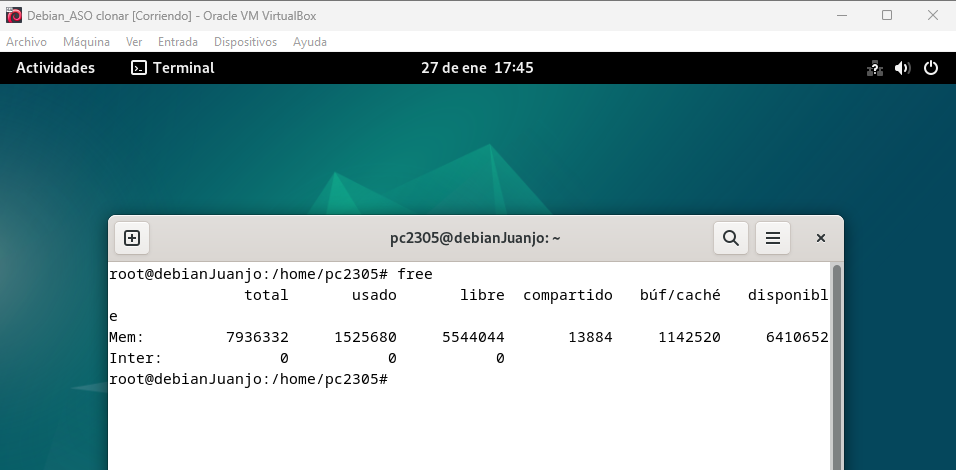
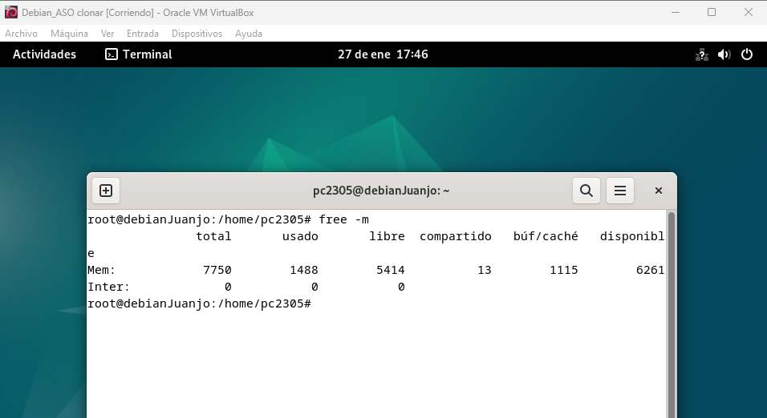
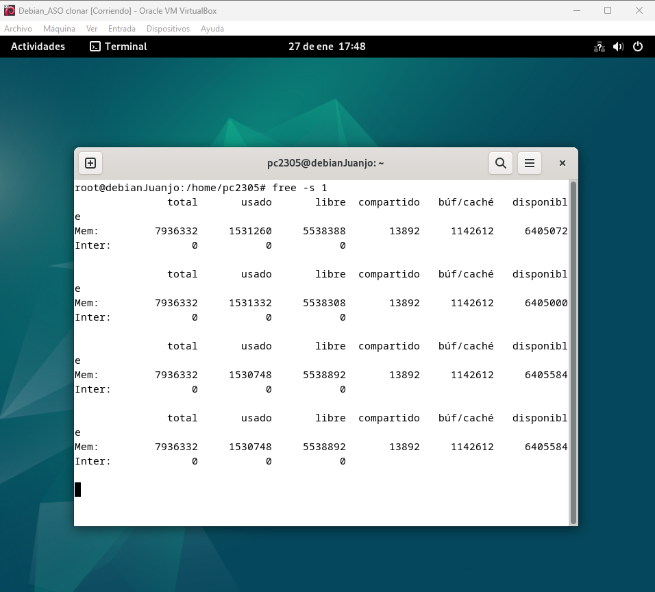

# <h1 align="center"> Monitorización del Almacenamiento </h> 

La *"monitorización del almacenamiento"* es crucial para asegurarse de que el sistema tiene suficiente espacio disponible en el disco y para evitar que se sobrecargue. Además, permite detectar posibles cuellos de botella relacionados con el acceso a disco. 

## **Herramientas principales:** 

*FREE* 
- Este comando proporciona toda la información sobre la RAM, cuanta RAM se está utilizando, cuenta está disponible, etc. El comando free sin opciones nos devolverá entonces los resultados para la memoria Total, Usada y Libre de tu ordenador o servidor. 
  - <ins>free:</ins> Muestra la memoria total, usada y libre.

  - <ins>free -m:</ins> Muestra la memoria en megabytes.

  - <ins>free -s 1:</ins> Actualiza la información de la memoria cada segundo.

 
*DF* 
- El comando df (disk free) se utiliza para obtener un informe del espacio total, usado y disponible en los sistemas de archivos montados. 
  - <ins>df:</ins> Muestra el uso del espacio en disco. 
  - <ins>df -h:</ins> Muestra el uso del espacio en disco en un formato legible (ej. GB). 
  - <ins>df /:</ins> Muestra el uso del espacio en disco del sistema de archivos raíz. 

*DU* 
- Es un comando que significa “Disk Usage” (uso de disco). Su función principal es mostrar el espacio en disco utilizado por archivos y directorios en tu sistema. 
  - <ins>du /ruta/al/directorio:</ins> Muestra el tamaño de un directorio. 
  - <ins>du -h /ruta/al/directorio:</ins> Muestra el tamaño del directorio en un formato legible. 
  - <ins>du -a /ruta/al/directorio:</ins> Muestra el tamaño de todos los archivos y subdirectorios. 

*IOSTAT* 
- Proporciona estadísticas sobre la utilización de la CPU y los dispositivos de almacenamiento (discos duros, SSDs, etc.). Es muy útil para analizar el rendimiento de los discos y la carga de la CPU. 
  - <ins>iostat:</ins> Muestra estadísticas básicas de la utilización de CPU y discos. 
  - <ins>iostat 1:</ins> Actualiza las estadísticas cada segundo. 
  - <ins>iostat -d:</ins> Muestra estadísticas detalladas de todos los dispositivos de almacenamiento.
