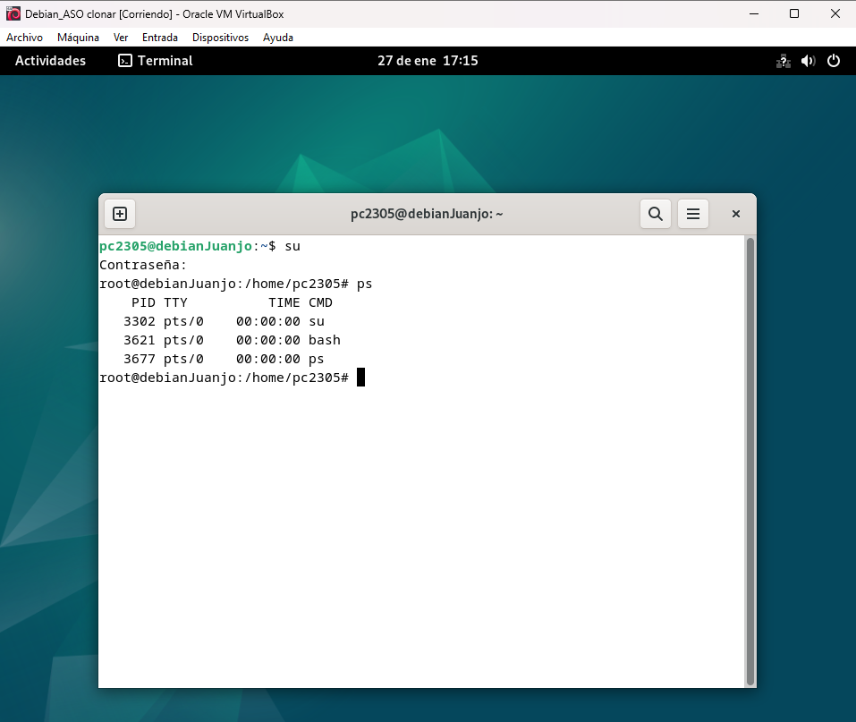
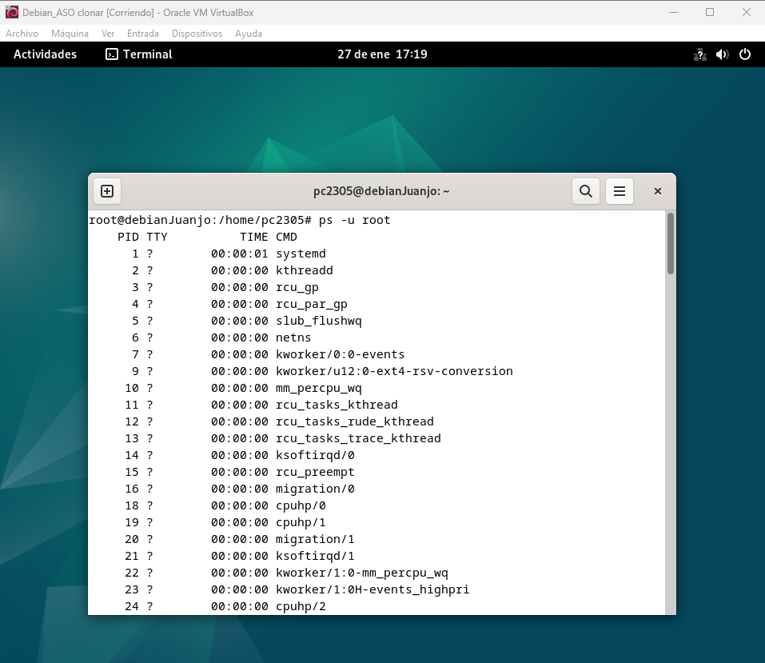
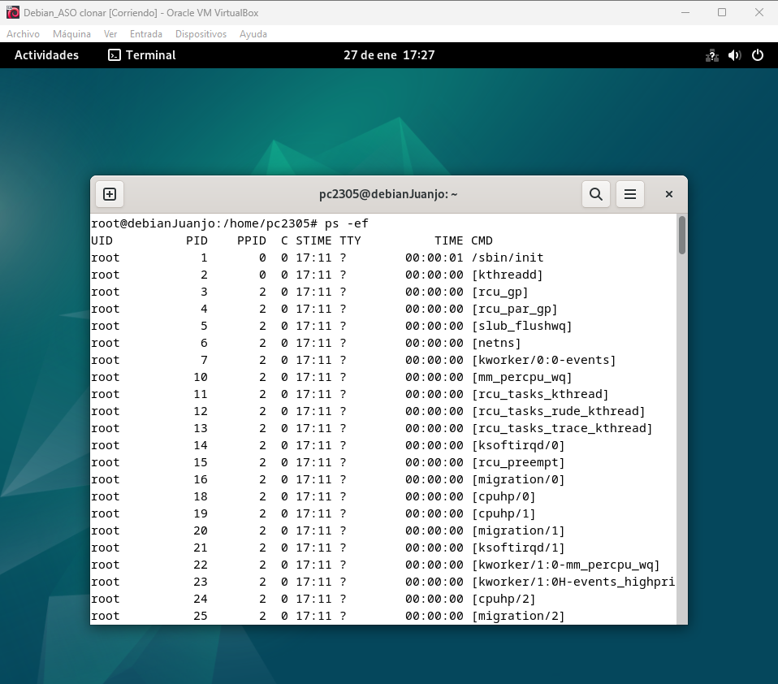
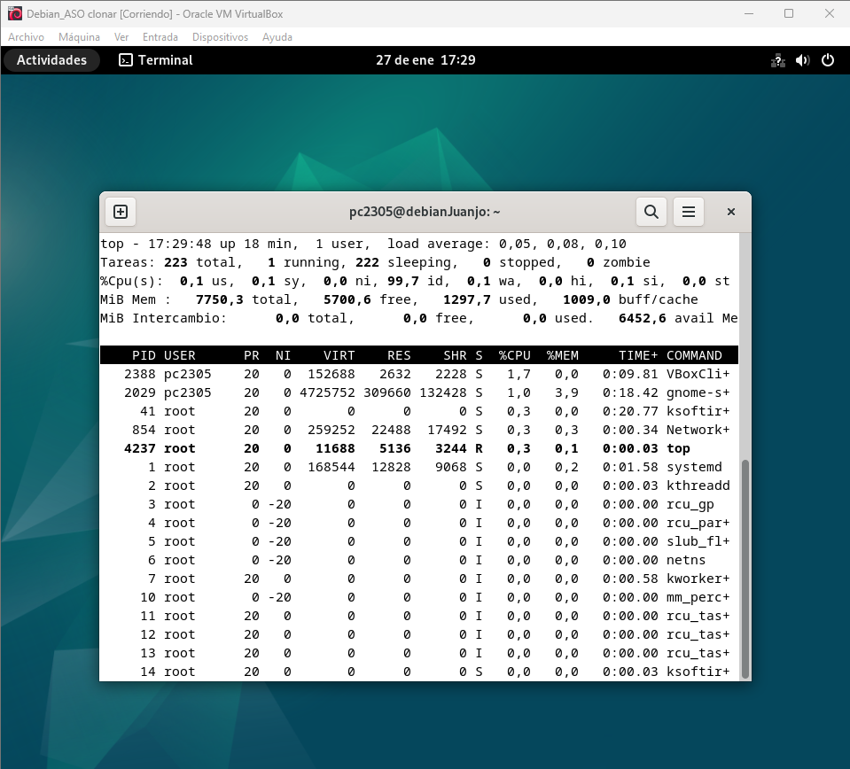
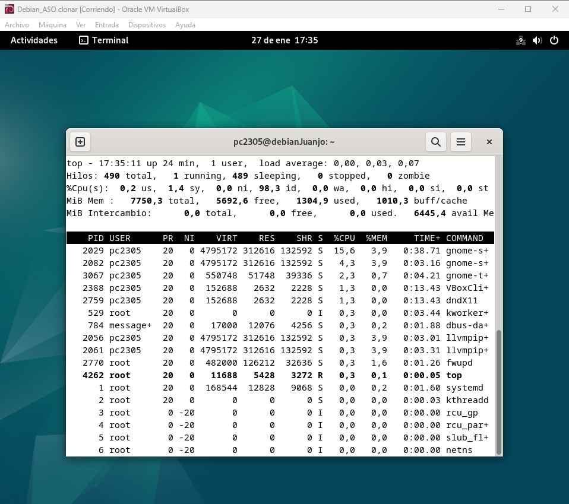
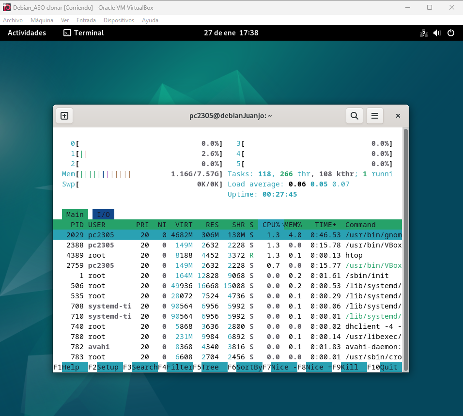
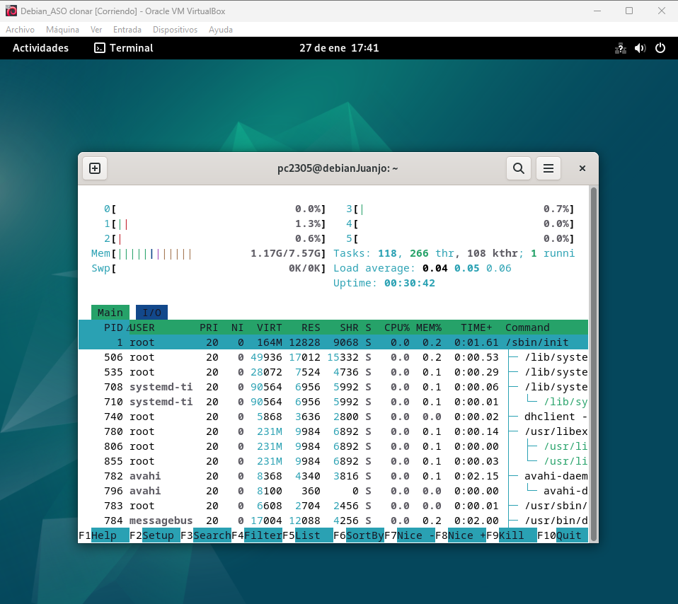
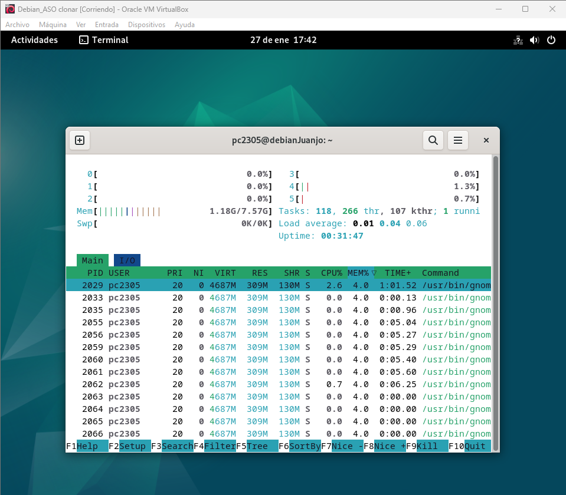
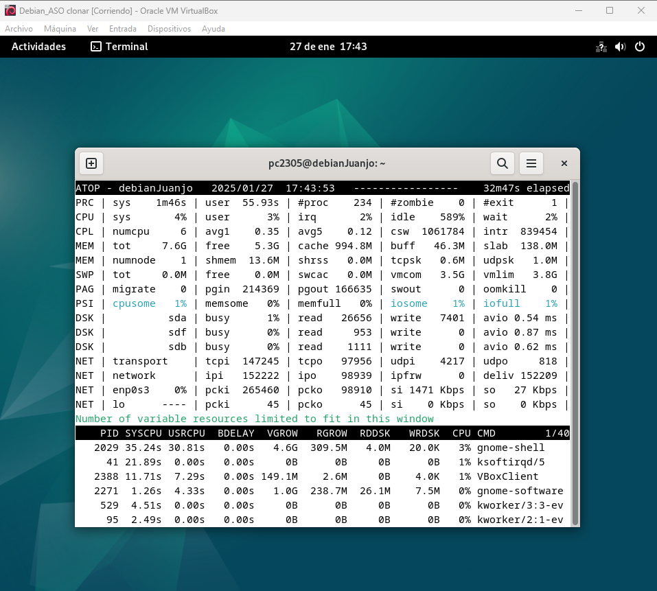
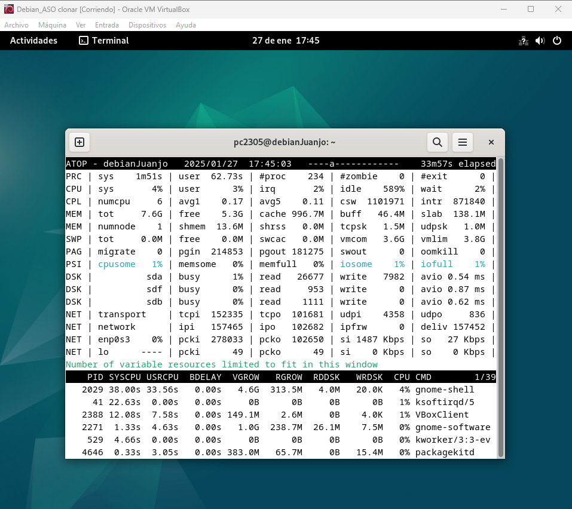

# <h1 align="center"> Monitorización de Procesos </h> 

La *"monitorización de procesos"* es esencial para conocer el comportamiento de los programas y servicios en ejecución en un sistema. Permite a los administradores identificar procesos que consumen demasiados recursos (como CPU o memoria), y gestionar su ejecución para mantener el rendimiento del sistema. 

## **Herramientas principales:** 

*PS*
- Proporciona una instantánea de los procesos en ejecución en el sistema. Se utiliza para obtener información sobre procesos activos y sus recursos asociados. 
  - <ins>ps:</ins> Muestra todos los procesos actuales.
 
  - <ins>ps -u root:</ins> Muestra los procesos ejecutados por el usuario root.
 
  - <ins>ps -ef:</ins> Muestra todos los procesos con detalles extendidos.

*TOP*
- Muestra una lista dinámica y en tiempo real de los procesos en ejecución, permitiendo observar qué procesos consumen más recursos del sistema. A diferencia de ps, top se actualiza continuamente.
  - <ins>top:</ins> Muestra en tiempo real los procesos más activos.

  - <ins>top -h:</ins> Muestra información de la memoria activada y desactivada.

  - <ins>top -u root:</ins> Muestra los procesos del usuario root.

*HTOP*
- Es una versión mejorada de top, con una interfaz gráfica más amigable, que también muestra información en tiempo real de los procesos y recursos del sistema. Ofrece opciones interactivas como ordenar por diferentes columnas y visualizar los procesos en un árbol. 
  - <ins>htop:</ins> Muestra una interfaz interactiva para monitorear los procesos.

  - <ins>htop -t:</ins> Muestra los procesos en forma de árbol.

  - <ins>htop --sort-key PERCENT_MEM:</ins> Ordena los procesos por uso de memoria.

*ATOP*
- Es una herramienta avanzada que ofrece una monitorización más detallada, mostrando estadísticas sobre el uso de CPU, disco, memoria, red y más. También puede almacenar registros históricos para su posterior análisis.
  - <ins>atop:</ins> Muestra el uso de recursos del sistema en tiempo real.

  - <ins>atop -d 2:</ins> Actualiza la información de los recursos cada 2 segundos.

  - <ins>atop -a:</ins> Muestra solo los procesos activos.

