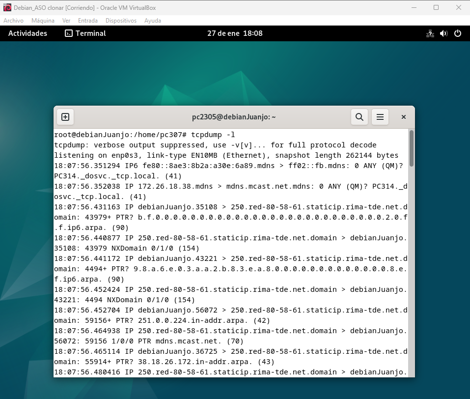
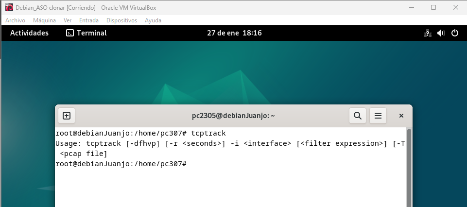
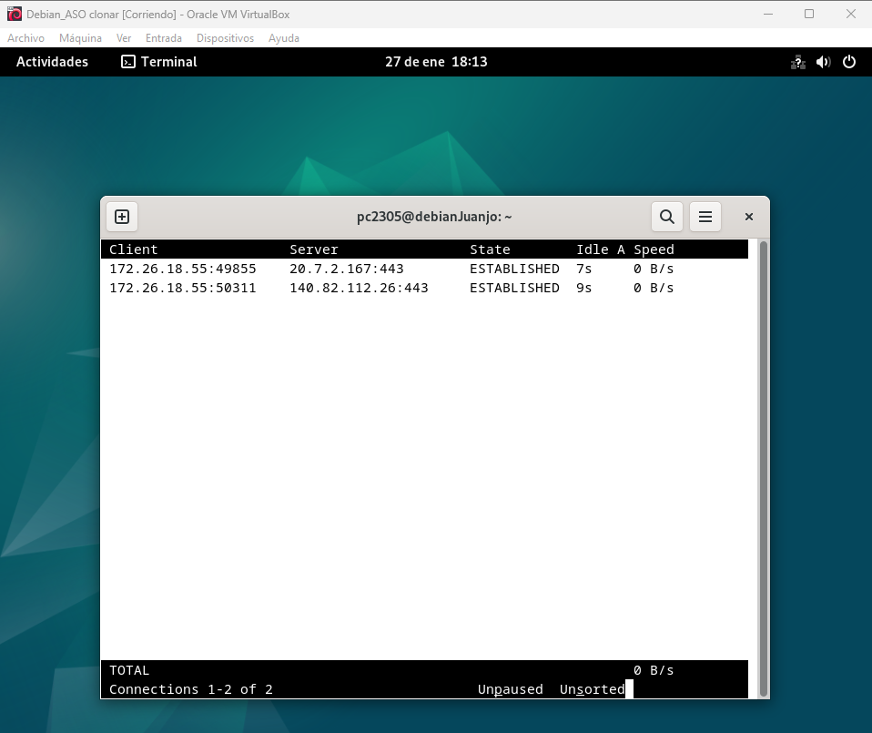
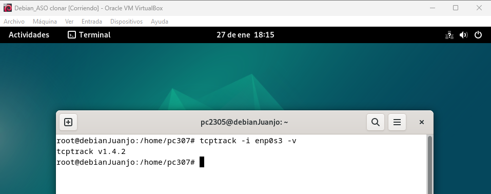
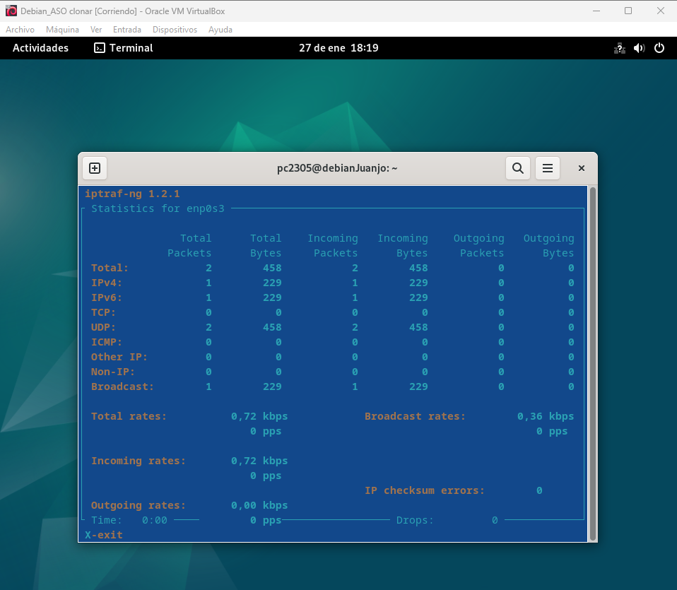
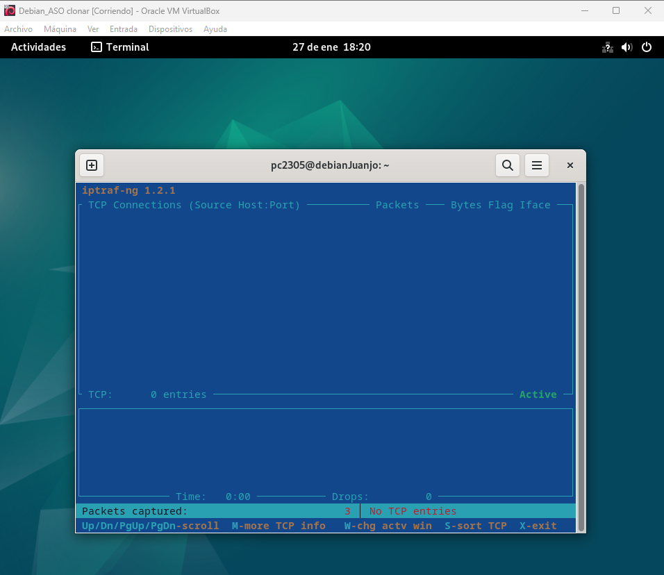
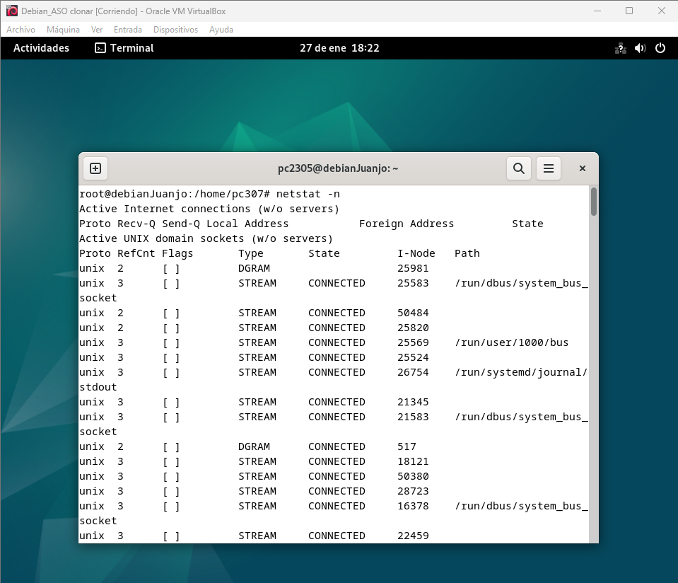
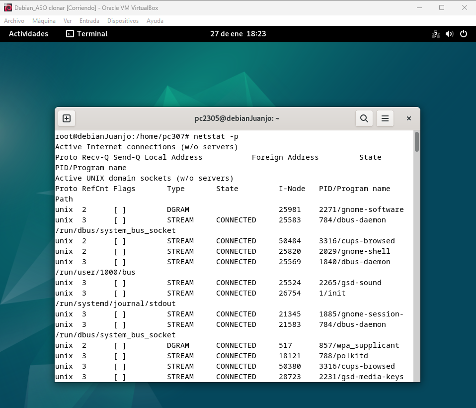
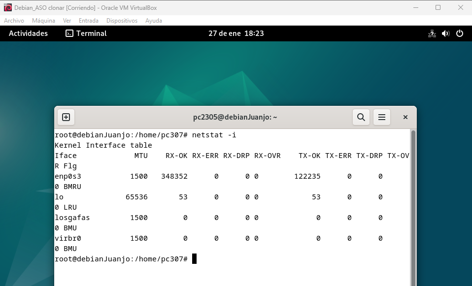

# <h1 align="center"> Monitorización de la Red </h> 

La *"monitorización de la red"* permite observar el tráfico de datos que fluye a través de las interfaces de red, así como gestionar conexiones activas y analizar el rendimiento de la red. Esto es útil para detectar problemas de conectividad, optimizar el tráfico y realizar auditorías de seguridad. 

## **Herramientas principales:** 

*TCPDUMP* 
- Es una herramienta cuya utilidad principal es analizar el tráfico que circula por la red. Permite al usuario capturar y mostrar en tiempo real los paquetes transmitidos y recibidos por la red a la cual el ordenador está conectado. 
  - <ins>tcpdump:</ins> Captura todos los paquetes en la interfaz de red predeterminada. 
 
  - <ins>tcpdump -l:</ins> Captura paquetes que se envían desde o hacia la dirección IP 192.168.1.1 en la interfaz eth0. 
 
  - <ins>tcpdump -v:</ins> Muestra solo las cabeceras de los paquetes en detalle. 
 

*TCPTRACK* 
- Muestra las conexiones TCP activas en tiempo real, indicando las direcciones IP de origen y destino, el estado de la conexión y la cantidad de datos transmitidos. 
  - <ins>sudo tcptrack:</ins> Muestra las conexiones TCP activas en la interfaz de red predeterminada. 
 
  - <ins>sudo tcptrack -i eth0:</ins> Muestra todas las conexiones TCP activas en tiempo real en la interfaz eth0. 
 
  - <ins>sudo tcptrack -i eth0 -v:</ins> Muestra estadísticas detalladas de las conexiones TCP activas en la interfaz eth0. 
 

*IPTRAF-NG* 
- Es una herramienta interactiva que ofrece estadísticas detalladas sobre el tráfico de red en tiempo real. Se utiliza para supervisar y analizar conexiones de red, tráfico de datos y más.
  - <ins>sudo iptraf-ng -d:</ins> Muestra estadísticas de tráfico en modo automático. 
 
  - <ins>sudo iptraf-ng -i:</ins> Muestra estadísticas de tráfico para la interfaz eth0. 
 
  - <ins>sudo iptraf-ng -l:</ins> Ejecuta iptraf-ng en segundo plano y genera un informe de tráfico. 
 

*NETSTAT* 
- Es una herramienta clásica para inspeccionar las conexiones de red, los puertos abiertos y las estadísticas de red. 
  - <ins>netstat -n:</ins> Muestra todas las conexiones establecidas con direcciones numéricas. 
 
  - <ins>netstat -p:</ins> Muestra las conexiones de red y los programas asociados. 
 
  - <ins>netstat -i:</ins> Muestra estadísticas detalladas de las interfaces de red. 
 

## Selección de página 
[Volver](./Monitorización-Almacenamiento.md)     
[Ir a Referencias](./Referencias.md)  
